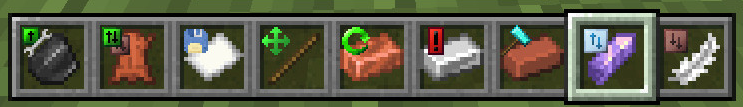
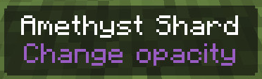

# Pack creation options
HoloPrint offers a variety of options during pack creation, allowing you to customise many parts of your resource pack.
## Settings
### Ghost block scale
Controls the size of each ghost block. 100% will be the same size as regular blocks, but may cause z-fighting.
### Textures
#### Overlay tint
If you want an overlay tint over your hologram, you can change the overlay tint colour and opacity.  
You can then [toggle the overlay tint in-game](/hologram-controls#toggle-tint).
#### Outline
The ghost block texture outline can be customised. The width (thickness), colour, and opacity of the outline can be changed.
### In-game controls
The specific items needed to [control the hologram](/hologram-controls) can be changed. Multiple items can be assigned to the same control.  
[Item tags](https://minecraft.wiki/w/Item_tag_(Bedrock_Edition)) can also be assigned to controls.
### Features
#### Spawn animation
Enables/Disables the hologram spawn animation when the armour stand is first placed down. During the animation, it may cause lag, especially for large structures.
#### Player controls
Enables/Disables [controlling the hologram](/hologram-controls) by attacking with specific items.
#### Material list
Enables/Disables the in-game [material list](/hologram-controls#material-list), accessible by pressing the tab key or the book icon.
#### Retexture control items
Enables/Disables icons overlayed on the hologram control items representing how they control the hologram.  

#### Rename control items
Enables/Disables the labels displayed underneath the names of hologram control items.  

### Ignored blocks
Enter the block IDs of any blocks that should be left out from the hologram, separated by spaces.
### Advanced
#### Initial offset
Controls the initial offset of the hologram from the armour stand, in X/Y/Z coordinates. Useful with large structures.
#### Backup slot count
Controls how many backup slots there are for [saving the hologram settings](/hologram-controls#save-hologram-settings).
#### Control item texture scale
If you play with a non-power-of-two resource pack (this means anything that isn't 8x, 16x, 32x, 64x, etc.), the [retextured control items](#retexture-control-items) can cause the original item textures to be distorted. If this happens, try changing the control item texture scale to 2, 4, etc. It will cause a slightly higher pack size.
#### Opacity mode
If set to `In-game controls`, the hologram opacity will be [changeable in-game](/hologram-controls#change-transparency).  
If set to `Single option`, the opacity of the hologram will be fixed at a certain value. This will reduce pack size and may reduce lag.
## Metadata
### Pack name
The name of the resource pack, which will appear in the file name and the material list.
### Pack icon
The icon of the resource pack, when seen in the Minecraft resource pack settings.
### Structure author
Allows you to identify any authors of the structure used to make the hologram.
### Description
Allows you to write an extended description about the structure or resource pack.
### Compression level
The zip/deflate [compression level](https://en.wikipedia.org/wiki/Deflate) (0-9). Lower means faster processing time but a larger file size. Level 0 has no compression.
## Resource packs
Allows you to upload a local resource pack from an entire folder. This can be used to change the textures of the ghost blocks in the hologram.
### Clear resource pack cache
The resource pack cache speeds up accessing files in the resource pack. If you modify the local resource pack after using it already in HoloPrint, the old files will be cached, so the cache should be cleared.